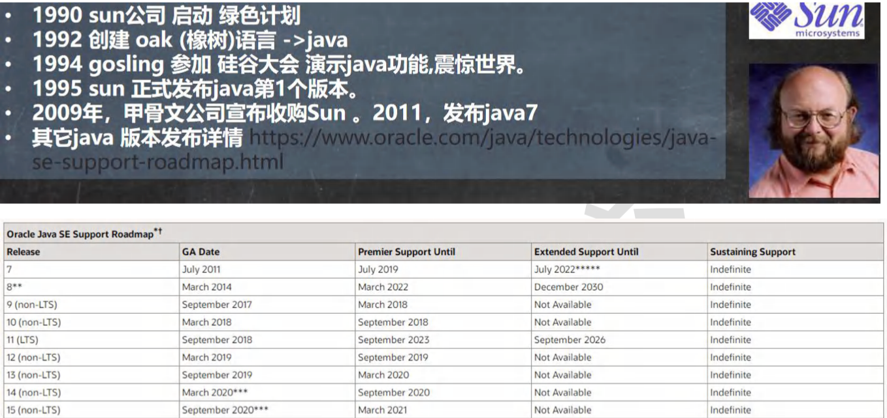
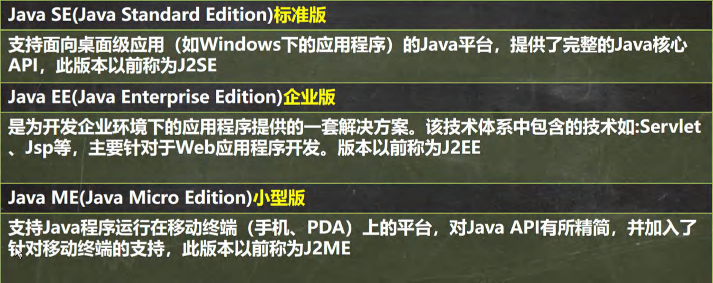
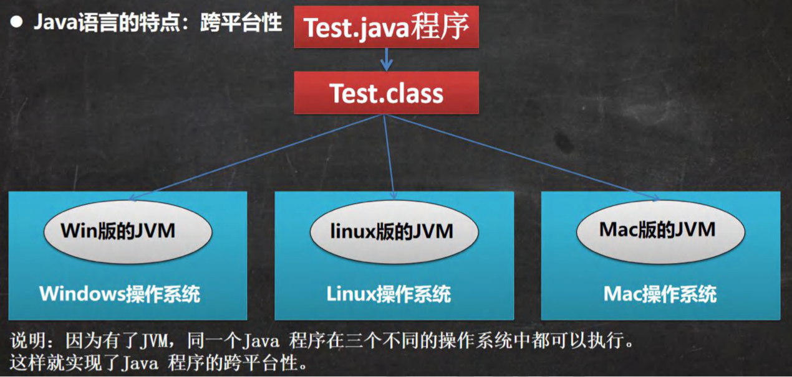
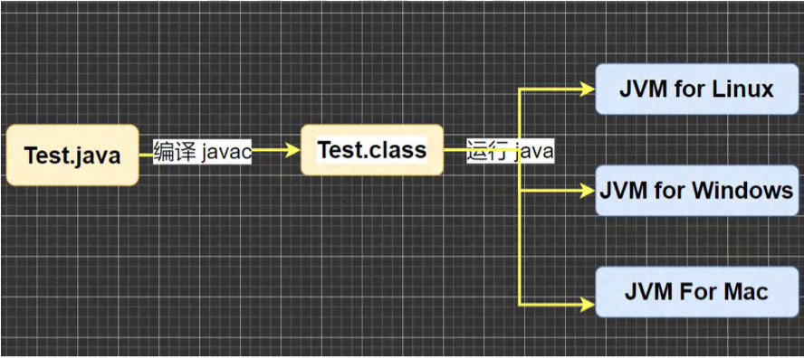
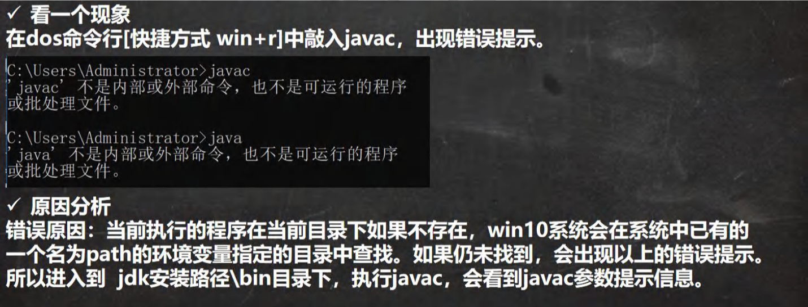
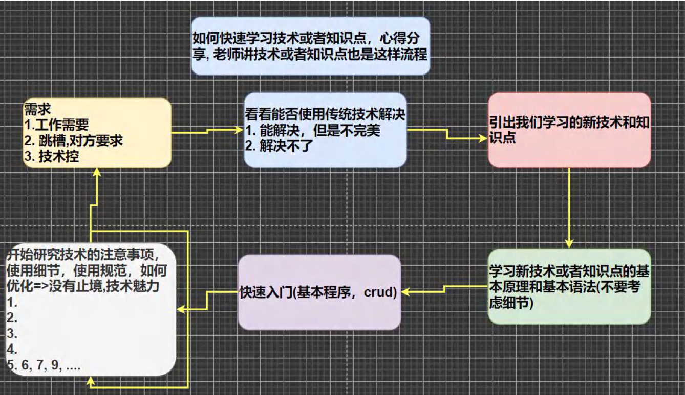
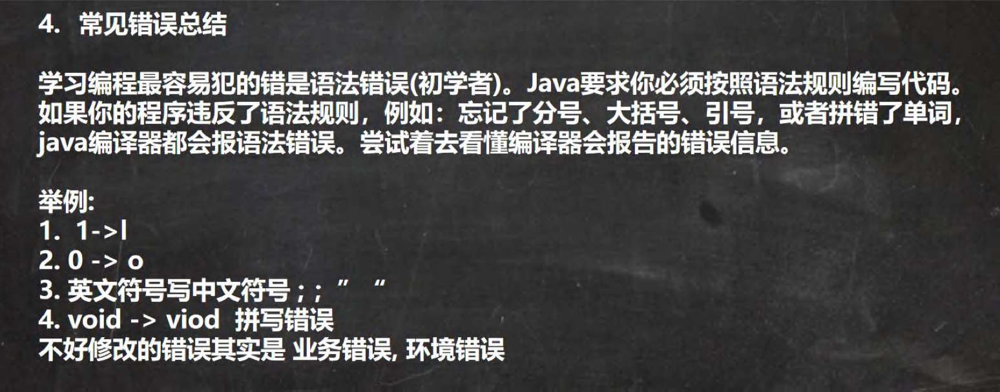

## 第 2 章 Java 概述

### 2.1 什么是程序

​	程序：计算机执行某些操作或解决某个问题而编写的一系列有序指令的集合

​	举例说明：


### 2.2 Java 诞生小故事



​		1990年,Sun微系统应对C++语言的流行,组建了一个称为Green的小团队,目标是开发一门面向对象的语言。团队首席架构师James Gosling最初将这门语言命名为Oak,取白橡树之意,想表达健壮、力量的意境。但是在申请语言名称时,发现Oak已被注册。于是改名为Java,来源于团队成员常去的一家Java咖啡厅。Java最初是作为家用电器等嵌入式设备的编程语言来设计的。但是后来Sun看到互联网的发展,将Java定位为网络语言。1995年,Sun正式对外发布Java 1.0版本。随后Java迅速流行,成为最重要的网络编程语言之一。Java的成功在于它简单、面向对象、支持网络移动,并且有Sun强力的市场推广。Java的发展历程证明了一个好的编程语言,需要技术创新与市场运作的有机结合。James Gosling也因Java而成为编程领域的著名人物。Java已经在25年里经历了长足发展,仍是今天最流行的语言之一。

| 时间 | 事件                                                 |
| :--: | ---------------------------------------------------- |
| 1995 | Oak语言诞生                                          |
| 1996 | 改名为Java <br> Sun微系统内部使用                    |
| 1997 | Java 1.0发布                                         |
| 1998 | Java 1.1发布                                         |
| 1999 | Java 2发布,更名为Java 1.2 <br> J2EE出现,用于企业应用 |
| 2000 | Dot com泡沫 <br> Java继续流行于企业应用              |
| 2002 | J2EE 1.4发布                                         |
| 2004 | J2SE 5.0发布,引入泛型、注解等特性                    |
| 2006 | Sun收购MySQL                                         |
| 2009 | Oracle收购Sun                                        |
| 2011 | Java 7发布                                           |
| 2014 | Java 8发布,Lambda表达式问世                          |
| 2022 | Java 19 LTS发布                                      |


```mermaid
graph TD

  1995[Oak诞生<br>1995]---1996[Java之父<br>1996]
  
  1996---1997[1.0发布<br>1997]
  1997---1998[1.1发布<br>1998]
  
  1996---1999[J2EE<br>1999]
  1999---2000[泡沫<br>2000]
  
  2000---2002[1.4发布<br>2002]
  2002---2004[5.0泛型<br>2004]
  
  2004---2006[收购MySQL<br>2006]
  2006---2009[Oracle<br>2009]  

  2009---2011[Java 7<br>2011]
  2011---2014[Java 8 Lambda<br>2014]
  
  2014---2022[Java 17<br>2022]

  click 1995 "https://www.oracle.com/java/technologies/oak.html"
  click 1996 "https://www.oracle.com/java/technologies/javase/javase8-archive-downloads.html"
```

### 2.3 Java 技术体系平台



### 2.4 Java 重要特点

1. Java语言是面向对象的（oop)
2. Java语言是健壮的。Java的强类型机制、异常处理、垃圾的自动收集等是Java程序健壮性的重要保证
3. Java语言是跨平台性的。[即: 一个编译好的.class 文件可以在多个系统下运行，这种特性称为跨平台]


4. Java 语言是解释型的[了解]

​		解释性语言：javascript,PHP, java 编译性语言: c / c++

​		区别是：解释性语言，编译后的代码，不能直接被机器执行,需要解释器来执行, 编译性语言, 编译后的代码, 可以直接被机器执行, c /c++

> 对,Java通常被认为是一种解释型语言。
>
> 主要原因有:
>
> 1. Java程序需要Java虚拟机(JVM)来执行。开发者编写的Java代码会先被编译成Java字节码,然后在JVM上运行。JVM会对字节码进行解释执行,所以从这个层面上Java属于解释型语言。
>
> 2. JVM包含一个即时(Just-In-Time)编译器,它可以在运行时将部分热点字节码编译成机器码,以提高执行效率。但是JVM仍需要解释执行大部分字节码,整体来看Java仍属于解释型语言。
>
> 3. Java语言规范中没有链接器。Java编译器只生成字节码,不产生可直接在硬件上运行的机器码,这也是一种解释型语言的特征。
>
> 4. Java开发者编写的源代码到程序实际运行需要进行两次转换:源代码到字节码的编译和字节码到机器码的解释,这也符合解释型语言的特点。
>
> 5. 与编译型语言(如C、C++)相比,Java无需进行链接过程,开发效率较高,这是解释型语言的一大优点,Java沿袭了这一特性。
>
> 所以,综合来说,虽然Java的执行效率和编译型语言相比略低,但作为一种解释型语言,Java有其他的优势,如开发效率高、跨平台性好等。这些特性使得Java成为一种非常流行的解释型编程语言。

### 2.5 Java的开发工具


#### 2.5.1 工具选择

- 如何选择开发工具

​		我们先选择用文本编辑器本 sublime，到大家对 java 有一定了解后，我们再使用 IDEA 和 Eclipse 开发工具。

- 这是为什么呢

  更深刻的理解 java 技术,培养代码感。【面试时，往往程序员手写代码】 有利于公司面试。

### 2.6 Java运行机制及运行过程

#### 2.6.1 Java语言的特点：跨平台性



#### 2.6.2 Java核心机制-Java虚拟机 [JVM java virtual machine]

- 基本介绍

  1. JVM是一个虚拟的计算机，具有指令集并使用不同的存储区域。负责执行指令，管理数据、内存、寄存器，包含在JDK中。

  2. 对于不同的平台，有不同的虚拟机。

  3. Java虚拟机机制屏蔽了底层运行平台的差别，实现了“一次编译，到处运行”[说明]

  示意图

  

### 2.7 什么是JDK，JRE

#### 2.7.1 基本介绍

1）JDK的全称（Java Development Kit	Java开发工具包）

​	  JDK = JRE + java的开发工具[java.javac,javadoc,javap等]

2）JDK是提供给Java开发人员使用的，其中包含了java的开发工具，也包含了JRE。

​	  所以安装了JDK，就不用再单独安装JRE了。

#### 2.7.2 基本介绍

1）JRE（Java Runtime Environment 	Java运行环境）

​	  JRE = JVM + Java的核心类库[类]

2）包括 Java 虚拟机(JVM Java Virtual Machine)和 Java 程序所需的核心类库等，如果想要运行一  	  个开发好的 Java 程序， 计算机中只需要安装 JRE 即可。

#### 2.7.3 JDK、JRE和JVM的包含关系

1）JDK = JRE +开发工具集（例如javac，java编译工具等）

2）JRE = JVM + Java SE 标准类库（java核心类库）

3）如果只想运行开发好的.class文件 只需要JRE

### 2.8 下载、安装JDK

- 官方网址：

  [官网地址]:https://www.oracle.com/java/technologies/downloads/

- 安装JDK步骤

  1. 傻瓜式安装，下一步即可。
  2. 看老师演示

- 细节说明

- 安装路径不要有中文或者特殊符号如空格等。比如d:\program\hspjdk8

- 当提示安装JRE时，可以选择不安装。

### 2.9 配置环境变量 path

#### 2.9.1为什么要配置path



#### 2.9.2 配置环境变量path的步骤

1. 我的电脑--属性--高级系统设置--环境变量
2. 增加JAVA_HOME环境变量，指向jdk的安装目录d:\program\hspjdk8
3. 编辑path环境变量，增加 %JAVA_HOME%\bin
4. 打开DOS命令行，任意目录下敲打javac/java。如果出现javac 的参数信息，配置成功。

### 2.10 安装JDK的练习

#### 2.10.1 请同学们安装好 JDK，配置好 path 环境变量。可以在控制台下正确的执行, (10min)


#### 2.10.2 环境变量配置细节说明：


### 2.11 Java快速入门

#### 2.11.1 需求说明

要求开发一个Hello.java程序,可以输出“helle,world!"

#### 2.11.2 开发步骤

1）将Java代码编写到扩展名为Hello,java的文件中。[代码说明]

2）通过javac命令该jav文件进行编译，生成.class文件。

3）通过java命令对生成的class文件进行运行。

#### 2.11.3 运行原理示意图


### 2.12 Java开发快速入门

- 课堂小练习

  要求开发一个Hello.java程序，可以输出“Recall is studying java！” 

- 文件有中文时，如何处理

  1. 在文件->设置文件编码->GBK
  2. 需要重新保存即可

```java
public class Hello {

	//编写一个主方法
	public static void main(String[] args){
		System.out.println("Recall is studing java!");
	}
}
```


- 什么是编译

  javac Hello.java

  1. 有了java源文件，通过编译器将其编译成JVM可以识别的字节码文件。
  2. 在该源文件目录下，通过javac编译工具对Hello.java文件进行编译.
  3. 如果程序没有错误，没有任何提示，但在当前目录下会出现一个Hello.class文件，该文件称为字节码文件，也是可以执行的java的程序。

- 什么是运行

  1. 有了可执行的java程序（Hello.class字节码文件）
  2. 通过运行工具java.exe对字节码文件进行执行，本质就是.class装载到jvm机执行

- java程序开发注意事项

  对修改后的Hello.java源文件需要重新编译，生成新的class文件后，再进行执行，才能生效。

### 2.13 Java开发注意事项和细节说明

1. Java源文件以.java为扩展名。源文件的基本组成部分是类（class），如本类中的Hello类。

2. Java应用程序的执行入口是main()方法。它有固定的书写格式：

   ```java
   public static void main(String[] args) {...} 
   ```

3. Java语言严格区分大小写。
4. Java方法由一条条语句构成，每个语句以";"结束。
5. 大括号都是成对出现的，缺一不可。[习惯，先写{}再写代码]
6. 一个源文件中最多只能有一个public类。其它类的个数不限。[演示]
7. 如果源文件包含一个public类，则文件名必须按该类名命名！
8. 一个源文件中最多只能有一个public类。其它类的个数不限，也可以将main方法写在非public类中，然后指定运行非public类，这样入口方法就是非public的main方法

```java
//这是 java 的快速入门， 演示 java 的开发步骤 
//对代码的相关说明 
//1. public class Hello 表示 Hello 是一个类,是一个 public 公有的类 
//2. Hello{ } 表示一个类的开始和结束 
//3. public static void main(String[] args) 表示一个主方法,即我们程序的入口
//4. main() {} 表示方法的开始和结束 
//5. System.out.println("hello,world~"); 表示输出"hello,world~"到屏幕 
//6. ;表示语句结束
public class Hello {

//编写一个 main 方法 
  public static void main(String[] args) { 
    System.out.println("韩顺平教育 hello"); 
  }

}

//一个源文件中最多只能有一个 public 类。其它类的个数不限。[演示]
//Dog是一个类
//编译后，每一个类，都对应一个.class
class Dog{
  //一个源文件中最多只能有一个 public 类。其它类的个数不限，也可以将 main 方法写在非 public 类中，
  //然后指定运行非 public 类，这样入口方法就是非 public 的 main 方法
  public static void main(String[] args) {
    System.out.println("hello, 小狗狗~");
  }
}

class Tiger{
  public static void main(String[] args){
    System.out.prinrln("hello,小老虎~");
  }
}
```

### 2.14 老韩聊: 如何快速掌握技术或知识点



### 2.15 Java转义字符

#### 2.15.1	Java常用的转义字符

在控制台，输入tab键，可以实现命令补全

\t：一个制表位，实现对齐的功能

\n：换行符

\\\：一个\

\\"：一个“

\\'：一个‘

\\r：一个回车

#### 2.15.2 说明

应用实例

```java
//演示转义字符的使用
public class ChangeChar {
	public static void main(String[] args) {
// 		\t：一个制表位，实现对齐的功能
		System.out.println("北京\t天津\t上海");
// 		\n：换行符
		System.out.println("jack\nsmith\nmary");
// 		\\：一个\
		System.out.println("C:\\Windows\\System32\\cmd.exe");
// 		\"：一个“
		System.out.println("老韩说:\"要好好学习java,有前途\"");
// 		\'：一个‘
		System.out.println("老韩说:\'要好好学习java,有前途\'");
// 		\r：一个回车
		//解读
		//1. 输出 北京欢迎你
		//2. \r表示回车
		System.out.println("北京欢迎你！\r武汉");
	}
}
```

#### 2.15.3 课堂练习

要求：请使用一句输出语句，达到输入如下图形的效果


```java
public class ChangeCharExer01{
	public static void main(String[] args) {
		System.out.println("书名\t作者\t价格\t销量\n三国\t罗贯中\t120\t1000");
	}
}
```

### 2.16 初学java易犯错误




### 2.17 注释(comment)

#### 2.17.1 介绍：

​		用于注解说明解释程序的文字就是注释，注释提高了代码的阅读性（可读性）；注释是一个程序员必须要具有的良 好编程习惯。将自己的思想通过注释先整理出来，再用代码去体现。 [举例]

#### 2.17.2 Java中的注释类型

> 1）单行注释	//
>
> 2）多行注释	/* */
>
> 3）文档注释	/**	*/

#### 2.17.3 单行注释：

基本格式

格式：//注释文字

#### 2.17.4 多行注释：

基本格式

格式：/* 注释文字 */

#### 2.17.5 使用细节

1）被注释的文字，不会被JVM（java 虚拟机）解释执行

2）多行注释里面不允许有多行注释嵌套

#### 2.17.6 文档注释：

​	注释内容可以被JDK提供的工具javadoc所解析，生成一套以网页文件形式体现的该程序的说明文档，一般写在类

> Javadoc -d 文件夹名 -xx -yy Demo3.java

### 2.18 Java代码规范

1. 类、方法的注释，要以javadoc的方式来写。
2. 非Java Doc的注释，往往是给代码的维护者看的，着重告述读者为什么这样写，如何修改，注意什么问题等
3. 使用tab操作，实现缩进，默认整体向右边移动，或者用shift+tab整体向左移
4. 运算符和 = 两边习惯性各加一个空格。比如：2 + 4 * 5 + 345 - 89 
5. 源文件使用utf-8编码
6. 行宽度不要超过80字符
7. 代码编写**次行风格**和**行尾风格**


### 2.19 DOS命令(了解)

#### 2.19.1 DOS介绍

Dos：Disk Operating System 磁盘操作系统，简单说一下windows的目录结构图。[原理图]


#### 2.19.2 相关的知识补充：相对路径，绝对路径


#### 2.19.3 常用的dos命令

1）查看当前目录是有什么内容 dir

> dir		dir d:\abc2\test200

2）切换到其他盘下：盘符号	cd : change directory

> 案例演示：切换到c盘			cd/D	c:

3）切换到当前盘的其他目录下(使用相对路径和绝对路径演示),..\表示上一级目录

> 案例演示：cd	d:\abc2\test200	cd ..\\..\\abc2\test200

4）切换到上一级：

> 案例演示：cd ..

5）切换到根目录：cd \

> 案例演示：cd \

6）查看指定的目录下所有的子级目录 tree

7）清屏cls[苍老师]

8）退出 DOS exit

9）说明: 因为小伙伴后面使用 DOS 非常少，所以对下面的几个指令，老韩给大家演示下, 大家了解即可 (md[创建目 录],rd[删除目录],copy[拷贝文件],del[删除文件],echo[输入内容到文件],type,move[剪切]) => Linux