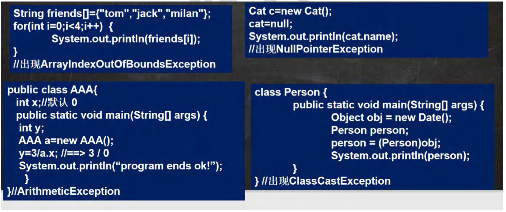
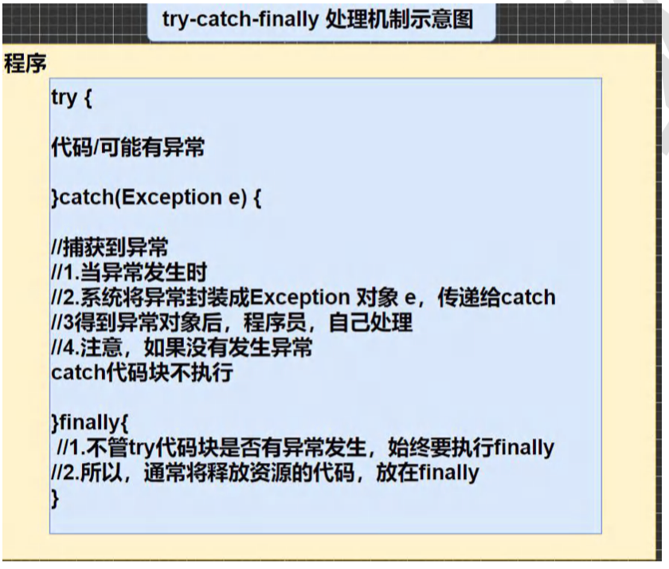
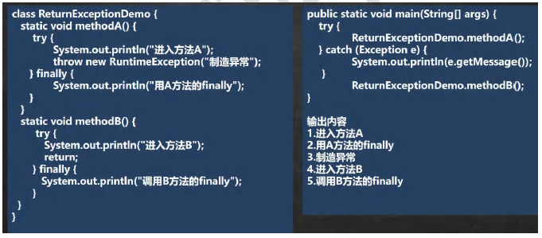
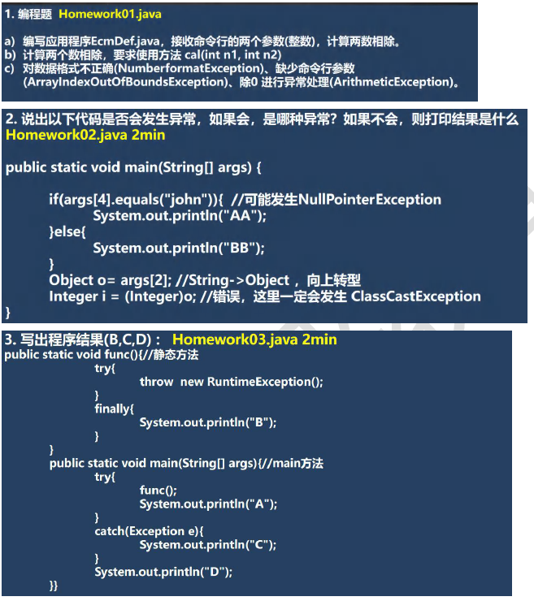
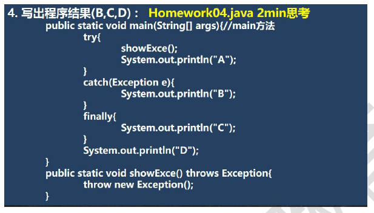

## 第 12 章 异常-Exception

### 12.1 看个实际的问题和一段代码

运行下面的代码，看看有什么问题-> 引出异常和异常处理机制【Exception01.java】

### 12.2 解决方案-异常捕获

对异常进行捕获，保证程序可以继续运行.使用try-catch

### 12.3 异常介绍

- 基本概念

  Java语言中，将程序执行中发生的不正常情况称为“异常”。(开发过程中的语法错误和逻辑错误不是异常)

- 执行过程中所发生的异常事件可分为两大类

  1. Error(错误)：Java虚拟机无法解决的严重问题。如：JVM系统内部错误、资源耗尽等严重情况。比如：StackOverflowError[栈溢出]和OOM(out of memory)，Error是严重错误，程序会崩溃。
  2. Exception：其它因编程错误或偶然的外在因素导致的一般性问题，可以使用针对性的代码进行处理。例如空指针访问，试图读取不存在的文件，网络连接中断等等，Exception 分为两大类：运行时异常[程序运行时，发生的异常]和编译时异常[编程时，编译器检查出的异常]。

### 12.4 异常体系图一览

#### 12.4.1 异常体系图


#### 12.4.2 异常体系图的小结

1. 异常分为两大类，运行时异常和编译时异常。
2. 运行时异常，编译器检查不出来。一般是指编译时的逻辑错误，是程序员应该避免其出现的异常。java.lang.RuntimeException类及它的子类都是运行时异常
3. 对于运行时异常，可以不作处理，因为这类异常很普遍，若全处理可能会对程序的可读性和运行效率产生影响
4. 编译时异常，是编译器要求必须处置的异常。

### 12.5 常见的运行时异常

#### 12.5.1 常见的运行时异常

1）NullPointerException 空指针异常

2）ArithmeticException 数学运算异常

3）ArrayIndexOutOfBoundsException 数组下标越界异常

4）ClassCastException 类型转换异常

5）NumberFormatException 数字格式不正确异常[]

#### 12.5.2 常见的运行时异常举例

1）NullPointerException 空指针异常【NullPointerException_.java】

当应用程序试图在需要对象的地方使用 null 时，抛出该异常。


2）ArithmeticException 数学运算异常【ArithmeticException_.java】

当出现异常的运算条件时，抛出此异常。例如，一个整数“除以零”时，抛出此类的一个实例。


3）ArrayIndexOutOfBoundsException 数组下标越界异常

用非法索引访问数组时抛出的异常。如果索引为负或大于等于数组大小，则该索引为非法索引


4）ClassCastException 类型转换异常

当试图将对象强制转换为不是实例的子类时，抛出该异常。

例如，以下代码将生成一个 ClassCastException


5）NumberFormatException 数字格式不正确异常

当应用程序试图将字符串转换成一种数值类型，但该字符串不能转换为适当格式时，抛出该异常 => 使用异常我们 可以确保输入是满足条件数字.


### 12.6 编译异常

#### 12.6.1 介绍

编译异常是指在编译期间，就必须处理的异常，否则代码不能通过编译。

#### 12.6.2 常见的编译异常

- SQLException //操作数据库时，查询表示可能发生异常
- IOException //操作文件时，发生的异常
- FileNotFoundException //当操作一个不存在的文件时，发生异常
- ClassNotFoundException //加载类，而该类不存在时，异常
- EOFException //操作文件，到文件末尾，发生异常
- IllegalArgumentException //参数异常

#### 12.6.3 案例说明

【Exception02.java】

### 12.7 异常课堂练习



### 12.8 异常处理

#### 12.8.1 基本介绍

异常处理就是当异常发生时，对异常处理的方式。

#### 12.8.2 异常处理的方式

1）try-catch-finally

程序员在代码中捕获发生的异常，自行处理

2）throws

将发生的异常抛出，交给调用者(方法)来处理，最顶级的处理者就是JVM

#### 12.8.3 示意图




### 12.9 try-catch 异常处理

#### 12.9.1 try-catch 方式处理异常说明

【TryCatch01.java】

1）Java提供try和catch块来处理异常。try块用于包含可能出错的代码。catch块用于处理try块中发生的异常。可以根据需要在程序中有多个try...catch块。

2）基本语法

try{

​	//可疑代码

​	//将异常生成对应的异常对象，传递给catch块

}catch(异常){

​	//对异常的处理

}

//如果没有finally，语法是可以通过

#### 12.9.2 try-catch 方式处理异常-快速入门

```java
public static void main(String[] args){
  int num1 = 10;
  int num2 = 0;
  try{
    int res = num1/num2;
  }catch(Exception e){
    System.out.println(e.getMessage());
  }
}
```

#### 12.9.3 try-catch 方式处理异常-注意事项 

【TryCatchDetail.java】

1）如果异常发生了，则异常发生后面的代码不会执行，直接进入到catch块。

2）如果异常没有发生，则顺序执行try的代码块，不会进入到catch。

3）如果希望不管是否发生异常，都执行某段代码块(比如关闭连接，释放资源等)则使用如下代码- finally{ }


4）可以有多个catch语句，捕获不同的异常(进行不同的业务处理)，要求父类异常在后，子类异常在前，比如(Exception在后，NullPointerException 在前)，如果发生异常，只会匹配一个catch。

【TryCatchDetail02.java】

5）可以进行 try-finally 配合使用，这种用法相当于没有捕获异常，因此程序会直接崩掉/退出。应用场景，就是执行一段代码，不管是否发生异常，都必须执行某个业务逻辑

```java
try{
  //代码...
}
finally{//总是执行
  
}
```

#### 12.9.4 异常处理课堂练习

1）题1 TryCatchExercise01.java


2）题2 TryCatchExercise02.java


3）题3 TryCatchExercise03.java


#### 12.9.5 try-catch-finally 执行顺序小结

1）如果没有出现异常，则执行try块中所有语句，不执行catch块中语句，如果有finally，最后还需要执行finally里面的语句

2）如果出现异常，则try块中异常发生后，try块剩下的语句不再执行。将执行catch块中的语句，如果有finally，最后还需要执行finally里面的语句！

#### 12.9.6 课后练习题：

【TryCatchExercise04.java】

如果用户输入的不是一个整数，就提示他反复输入，直到输入一个整数为止

### 12.10 throws异常处理

#### 12.10.1 基本介绍

1）如果一个地方(中的语句执行时)可能生成某种异常，但是并不能确定如何处理这种异常，则此方法应显示地声明抛出异常，表明该方法将不对这些异常进行处理，而由此方法的调用者负责处理。

2）在方法声明中用throws语句可以声明抛出异常的列表，throws后面的异常类型可以是方法中产生的异常类型，也可以是它的父类。

#### 12.10.2 快速入门案例

【Throws01.java】

#### 12.10.3 注意事项和使用细节 

【ThrowsDetail.java】

1）对于编译异常，程序中必须处理，比如try-catch 或者 throws

2）对于运行时异常，程序中如果没有处理，默认就是throws的方式处理

3）子类重写父类的方法时，对抛出异常的规定：子类重写的方法，所抛出的异常类型要么和父类抛出的异常一致，要么为父类抛出的异常的类型的子类型

4）在throws 过程，如果有方法try-catch，就相当于处理异常，就可以不必throws

### 12.11 自定义异常

#### 12.11.1 基本概念

当程序中出现了某些 “错误”，但该错误信息并没有在Throwable子类中描述处理，这个时候可以自己设计异常类，用于描述该错误信息。

#### 12.11.2 自定义异常的步骤

1）定义类：自定义异常类名(程序员自己写)继承Exception或RuntimeException

2）如果继承Exception，属于编译异常

3）如果继承RuntimeException，属于运行异常（一般来说，继承RuntimeException）

#### 12.11.3 自定义异常的应用实例

【CustomException.java】

当我们接收Person对象年龄时，要求范围在 18-120 之间，否则抛出自定义异常(要求 继承RuntimeException)，并给出提示信息。

### 12.12 throw 和 throws 的区别

#### 12.12.1 一览表


#### 12.12.2 测试题-下面的测试输出什么

【ThrowException.java】



### 12.13 本章作业



