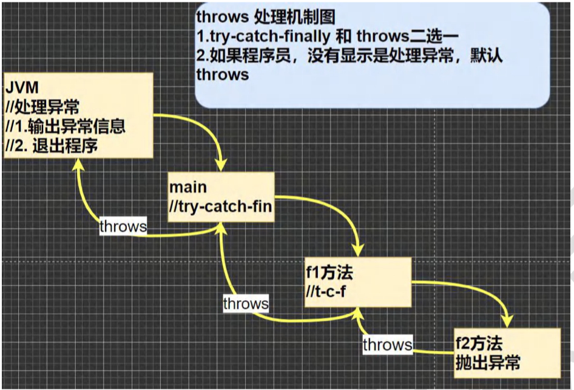

## 第 12 章 异常-Exception

### 12.1 看个实际的问题和一段代码

运行下面的代码，看看有什么问题-> 引出异常和异常处理机制【Exception01.java】

### 12.2 解决方案-异常捕获

对异常进行捕获，保证程序可以继续运行.使用try-catch

### 12.3 异常介绍

- 基本概念

  Java语言中，将程序执行中发生的不正常情况称为“异常”。(开发过程中的语法错误和逻辑错误不是异常)

- 执行过程中所发生的异常事件可分为两大类

  1. Error(错误)：Java虚拟机无法解决的严重问题。如：JVM系统内部错误、资源耗尽等严重情况。比如：StackOverflowError[栈溢出]和OOM(out of memory)，Error是严重错误，程序会崩溃。
  2. Exception：其它因编程错误或偶然的外在因素导致的一般性问题，可以使用针对性的代码进行处理。例如空指针访问，试图读取不存在的文件，网络连接中断等等，Exception 分为两大类：运行时异常[程序运行时，发生的异常]和编译时异常[编程时，编译器检查出的异常]。

### 12.4 异常体系图一览

#### 12.4.1 异常体系图

#### 12.4.2 异常体系图的小结

1. 异常分为两大类，运行时异常和编译时异常。
2. 运行时异常，编译器检查不出来。一般是指编译时的逻辑错误，是程序员应该避免其出现的异常。java.lang.RuntimeException类及它的子类都是运行时异常
3. 对于运行时异常，可以不作处理，因为这类异常很普遍，若全处理可能会对程序的可读性和运行效率产生影响
4. 编译时异常，是编译器要求必须处置的异常。

### 12.5 常见的运行时异常

#### 12.5.1 常见的运行时异常

1）NullPointerException 空指针异常

2）ArithmeticException 数学运算异常

3）ArrayIndexOutOfBoundsException 数组下标越界异常

4）ClassCastException 类型转换异常

5）NumberFormatException 数字格式不正确异常[]

#### 12.5.2 常见的运行时异常举例

1）NullPointerException 空指针异常【NullPointerException_.java】

当应用程序试图在需要对象的地方使用 null 时，抛出该异常。

2）ArithmeticException 数学运算异常【ArithmeticException_.java】

当出现异常的运算条件时，抛出此异常。例如，一个整数“除以零”时，抛出此类的一个实例。

3）ArrayIndexOutOfBoundsException 数组下标越界异常

用非法索引访问数组时抛出的异常。如果索引为负或大于等于数组大小，则该索引为非法索引

4）ClassCastException 类型转换异常

当试图将对象强制转换为不是实例的子类时，抛出该异常。

例如，以下代码将生成一个 ClassCastException

5）NumberFormatException 数字格式不正确异常

当应用程序试图将字符串转换成一种数值类型，但该字符串不能转换为适当格式时，抛出该异常 => 使用异常我们 可以确保输入是满足条件数字.

### 12.6 编译异常

#### 12.6.1 介绍

编译异常是指在编译期间，就必须处理的异常，否则代码不能通过编译。

#### 12.6.2 常见的编译异常

- SQLException //操作数据库时，查询表示可能发生异常
- IOException //操作文件时，发生的异常
- FileNotFoundException //当操作一个不存在的文件时，发生异常
- ClassNotFoundException //加载类，而该类不存在时，异常
- EOFException //操作文件，到文件末尾，发生异常
- IllegalArgumentException //参数异常

#### 12.6.3 案例说明

【Exception02.java】

### 12.7 异常课堂练习

### 12.8 异常处理

#### 12.8.1 基本介绍

异常处理就是当异常发生时，对异常处理的方式。

#### 12.8.2 异常处理的方式

1）try-catch-finally

程序员在代码中捕获发生的异常，自行处理

2）throws

将发生的异常抛出，交给调用者(方法)来处理，最顶级的处理者就是JVM

#### 12.8.3 示意图

