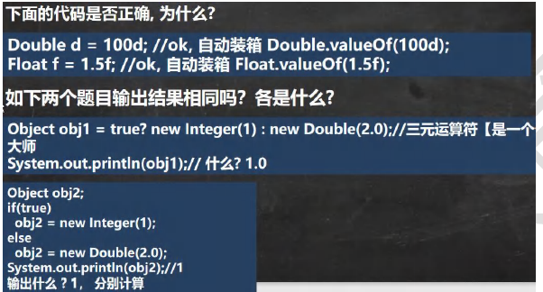
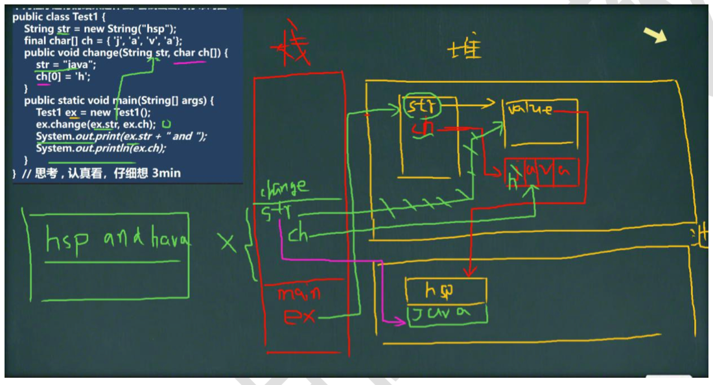

## 第 13 章 常用类

### 13.1 包装类

#### 13.1.1 包装类的分类

【WrapperType.java】

1）针对八种基本数据类型相应的引用类型—包装类

2）有了类的特点，就可以调用类中的方法。

3）如图：


#### 13.1.2 包装类和基本数据的转换

演示 包装类 和 基本数据类型的相互转换，这里以int 和 Integer演示。

1）jdk5 前的手动装箱和拆箱方式，装箱：基本类型->包装类型，反之，拆箱

2）jdk5 以后(含jdk5)的自动装箱和拆箱方式

3）自动装箱底层调用的是valueOf方法，比如Integer.valueOf()

4）其它包装类的用法类似

#### 13.1.3 案例演示

【Integer01.java】

#### 13.1.4 课堂测试题

【WrapperExercise01.java】



#### 13.1.5 包装类型和String类型的相互转换 

【WrapperVSString.java】

案例演示, 以Integer 和String 转换为例，其它类似:

#### 13.1.6 Integer类 和 Character 类的常用方法

【WrapperMethod.java】

#### 13.1.7 Integer 类面试题1

【WrapperExercise02.java】

#### 13.1.8 Intege 类面试题总结

【WrapperExercise03.java】

### 13.2 String类

#### 13.2.1 String 类的理解和创建对象

【String01.java】

1）String 对象用于保存字符串，也就是一组字符序列

2）字符串常量对象是用双引号括起来的字符编码。如：“你好”、“12.97”、“boy"等

3）字符串的字符使用Unicode字符编码，一个字符(不区分字母还是汉字)占两个字节。

4）String类较常用构造器:

- String s1 = new String();
- String s2 = new String(String original);
- String s3 = new String(char[] a);
- String s4 = new String(char[] a,int startIndex,int count);

说明：


#### 13.2.2 创建String对象的两种方式

1）方式一：直接赋值 String s = "hspedu";

2）方式二：调用构造器 String s = new String("hspedu");

#### 13.2.3 两种创建String对象的去呗

方式一：直接赋值 String s = "hspedu";

方式二：调用构造器 String s = new String("hspedu");

1. 方式一：先从常量池查看是否有"hsp"数据空间，如果有，直接指向；如果没有则重新创建，然后指向。s最终指向的是常量池的空间地址
2. 方式二：先在堆中创建空间，里面维护了value属性，指向常量池的hsp空间。如果常量池没"hsp",重新创建，如果有，直接通过value指向。最终指向的是堆中的空间地址。
3. 画出两种方式的内存分布图


#### 13.2.4 课堂测试题

1）测试题1

【StringExercise01.java】

```java
String a = "abc";
String b = "abc";
sout(a.equals(b));//T
sout(a == b);//T
```

2）测试题2

【StringExercise02.java】

```java
String a = "abc";
String b = new String("abc");
sout(a.equals(b));//T
sout(a == b);//F
```

3）测试题3

【StringExercise03.java】

```java
String a = "hsp";
String b = new String("hsp");
System.out.println(a.equals(b));
System.out.println(a == b);
System.out.println(a == b.intern());
System.out.println(b == a.intern());
```

知识点：

> 当调用intern方法时，如果池中已经包含一个等于此 String 对象的字符串（用equals(Object)方法确定），则返回池中的字符串。否则，将此String对象添加到池中，并返回此String对象的引用

解读：(1) b.intern() 方法最终返回的是常量池的地址(对象).

4）测试题4

【StringExercise04.java】

```java
String s1 = "hspedu";
String s2 = "java";
String s4 = "java";
String s3 = new String("java");
System.out.println(s2 == s3);//F
System.out.println(s2 == s4);//T
System.out.println(s2.equals(s3));//T
System.out.println(s1 == s2);//F
```

5）测试题5

【StringExercise05.java】

```java
Person p1 = new Person();
p1.name = "hspedu";
Person p2 = new Person();
p2.name = "hspedu";

System.out.println(p1.name.equals(p2.name));//比较内容
System.out.println(p1.name == p2.name);//T
System.out.println(p1.name == "hspedu");

String s1 = new String("bcde");
String s2 = new String("bced");
System.out.println(s1 == s2);//False
```


### 13.3 字符串的特性

#### 13.3.1 说明

【StringExercise06.java】

1）String是一个final类，代表不变的字符序列

2）字符串是不可变的。一个字符串对象一旦被分配，其内容是不可变的。

以下语句创建了几个对象？画出内存布局图。

```java
String s1 = "hello";
s1 = "haha";
//创建了2个对象
```


#### 13.3.2 面试题

1）题1

```java
String a = "hello" + "abc";
```

创建了几个对象？只有1个对象

//解读：String a = "hello" + "abc";// String a = "helloabc";

分析

1. 编译器不傻，做一个优化，判断创建的常量池对象，是否有引用指向
2. String a = "hello" + "abc"; => Stirng a = "helloabc";

2）题2

【StringExercise08.java】

```java
String a = "hello";//创建a对象
String b = "abc";//创建b对象
String c = a + b;
```

创建了几个对象？画出内存图

//关键就是要分析 String c = a + b;到底是如何执行的

//一共有3个对象


小结：底层是 StringBuilder sb = new StringBuilder()；sb.append(a)；sb.append(b)；sb是在堆中，并且append是在原来字符串的基础上追加的。

重要规则：String c1 = "ab" + "cd";常量相加，看的是池。String c1 = a + b;变量相加，是在堆中

3）题3

【StringExercise09.java】

下面代码输出什么，并说明原因.

```java
String s1 = "hspedu";//s1 指向池中的 "hspedu"
String s2 = "java";//s2 指向池中的 "java"
String s5 = "hspedujava";//s5 指向池中的 "hspedujava"
String s6 = (s1+s2).intern();//指向池中”hspedujava“的地址
System.out.println(s5 == s6);//T
System.out.println(s5.equals(s6));//T
```

4）题4

【StringExercise10.java】

下列程序运行的结果是什么，尝试画出内存布局图

```java

```


