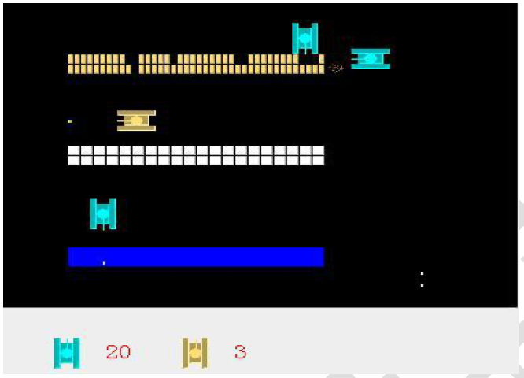
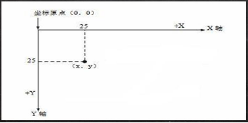

## 第 16 章 坦克大战[1]

### 16.1 坦克大战游戏演示

#### 16.1.1 游戏演示

#### 16.1.2 文档坦克游戏说明文档.doc

#### 16.1.3 为什么写这个项目

- 好玩
- 涉及到java各个方面的技术
  1. java面向对象编程
  2. 多线程
  3. 文件i/o操作
  4. 数据库
- 巩固旧知识，学习新知识

#### 16.1.4 写项目前的提醒

1. 编写坦克大战游戏，需要有一定的java基础，是完全可以听懂的
2. 记住一点：成为编程高手的秘诀就是：思考------编程------思考------编程

#### 16.1.5 如何讲解这个项目，授课的原则：

1. 努力做到通俗易懂
2. 宁可啰嗦一点，也不遗漏细节。
3. 项目是从小到大的过程，每个完整的项目被分解成不同的版本，从1.0到1.1 ...最后版，随版本的增加，将新的功能和新的知识点融入到项目中，整个过程是循序渐进的。让大家轻松的学习，高效的掌握java技术

### 16.2 java绘图坐标体现

#### 16.2.1 坐标体现-介绍

下图说明了Java坐标系。坐标原点位于左上角，以像素为单位。在Java坐标系中，第一个是x坐标，表示当前位置为水平方向，距离坐标原点x个像素；第二个是y坐标，表示当前位置为垂直方向，距离坐标原点y个像素。

#### 16.2.2 坐标体系-像素

1. 绘图还必须要搞清一个非常重要的概念-像素

   错误问法：一个像素等于多少厘米？

2. 计算机在屏幕上显示的内容都是由屏幕上的每 一个像素组成。例如，计算机显示器的分辨率是800x600，表示计算机屏幕上的每一行由800个点组成，共有600行，整个计算机屏幕共有480 000个像素。像素是一个密度单位，而厘米是长度单位，两者无法比较

#### 16.2.3 介绍-快速入门

在面板上画一个小圆[DrawCircle.java]

&nbsp;&nbsp;&nbsp;&nbsp;&nbsp;&nbsp;&nbsp;&nbsp;&nbsp;&nbsp;&nbsp;&nbsp;&nbsp;&nbsp;&nbsp;&nbsp;&nbsp;&nbsp;&nbsp;&nbsp;&nbsp;&nbsp;

#### 16.2.4 绘图原理

- Component提供了两个和绘图相关最重要的方法：
  1. paint(Graphics g)绘制组件的外观
  2. repaint()刷新组件的外观。
- 当组件第一次在屏幕显示的时候，程序会自动的调用paint()方法来绘制组件。
- 在以下情况paint()将会被调用：
  1. 窗口最小化，再最大化
  2. 窗口的大小发生变化
  3. repaint方法被调用

