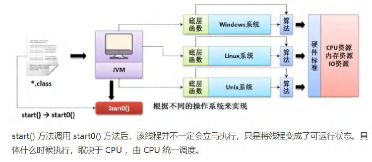

## 第 17 章 多线程基础

### 17.1 线程相关概念

#### 17.1.1 程序(program)

是为完成特定任务、用某种语言编写的一组指令的集合。

简单的说：就是我们写的代码

#### 17.1.2 进程

1. 进程是指运行中的程序，比如我们使用QQ，就启动了一个进程，操作系统就会为该进程分配内存空间。当我们使用迅雷，又启动了一个进程，操作系统将为迅雷分配新的内存空间。
2. 进程是程序的一次执行过程，或是正在运行的一个程序。是动态过程：有它自身的产生、存在和消亡的过程

#### 17.1.3 什么是线程

1. 线程由进程创建的，是进程的一个实体

2. 一个进程可以拥有多个线程，如下图

   

3. 坦克大战

   

#### 17.1.4 其他相关概念

1. 单线程：同一时刻，只允许执行一个线程
2. 多线程：同一时刻，可以执行多个线程，比如：一个qq进程，可以同时打开多个聊天窗口，一个迅雷进程，可以同时下载多个文件

3. 并发：同一个时刻，多个任务交替执行，造成一种“貌似同时”的错觉，简单的说，单核cpu实现的多任务就是并发。

   

4. 并行：同一时刻，多个任务同时执行。多核cpu可以实现并行。

   

### 17.2 线程基本使用

#### 17.2.1 创建线程的两种方式

在java中线程来使用有两种方法。

1. 继承Thread 类，重写 run方法
2. 实现Runnable接口，重写 run方法

#### 17.2.2 线程应用案例 1-继承 Thread类

[Thread01.java com.hspedu.threaduse]

1）请编写程序，开启一个线程，该线程每隔1秒。在控制台输出 "喵喵，我是小猫咪"

2）对上题改进：当输出80次 喵喵，我是小猫咪，结束该线程

3）使用JConsole 监控线程执行情况，并画出程序示意图！

#### 17.2.3 线程应用案例2-实现 Runnable 接口

- 说明

  1. java是单继承的，在某些情况下一个类可能已经继承了某个父类，这时在用继承Thread类方法来创建线程显然不可能了。
  2. java设计者们提供了另外一个方式创建线程，就是同过实现Runnable接口来创建线程

- 应用案例

  请编写程序，该程序可以每隔1秒。在控制台输出“hi！",当输出10次后，自动退出。请使用实现Runnable接口的方式实现。Thread02.java,这里底层使用了设计模式[代理模式] => 代码模拟 实现 Runnable接口 开发线程的机制

#### 17.2.4 线程使用应用案例-多线程执行

请编写一个程序，创建两个线程，一个线程每隔1秒输出“hello，world”，输出10次，退出，一个线程每隔1秒输出 “hi”，输出 5次退出.【Thread03.java】
