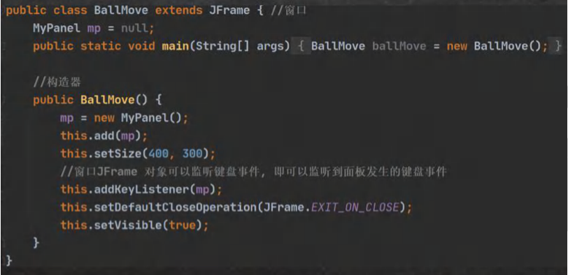
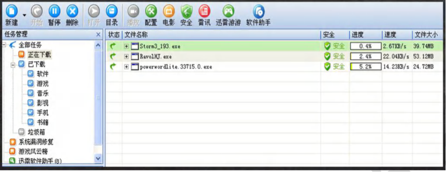

## 第 17 章 多线程基础

### 17.1 线程相关概念

#### 17.1.1 程序(program)

是为完成特定任务、用某种语言编写的一组指令的集合。

简单的说：就是我们写的代码

#### 17.1.2 进程

1. 进程是指运行中的程序，比如我们使用QQ，就启动了一个进程，操作系统就会为该进程分配内存空间。当我们使用迅雷，又启动了一个进程，操作系统将为迅雷分配新的内存空间。
2. 进程是程序的一次执行过程，或是正在运行的一个程序。是动态过程：有它自身的产生、存在和消亡的过程

#### 17.1.3 什么是线程

1. 线程由进程创建的，是进程的一个实体

2. 一个进程可以拥有多个线程，如下图

   

3. 坦克大战

   

