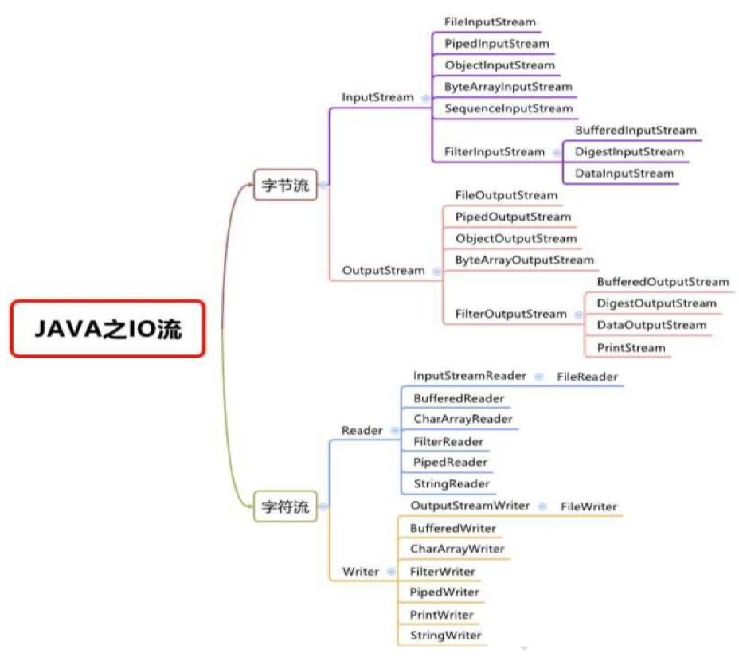
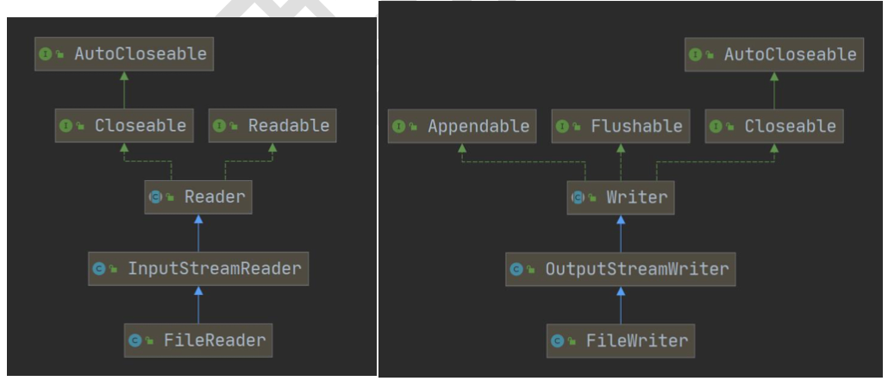
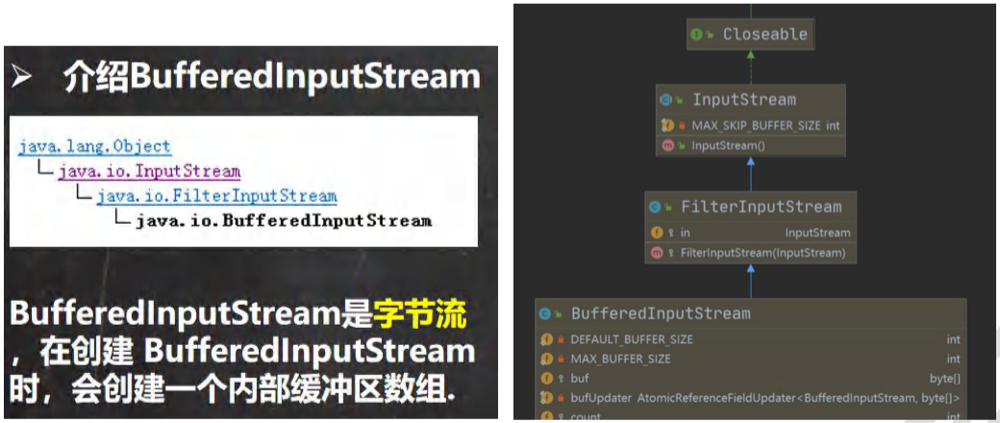
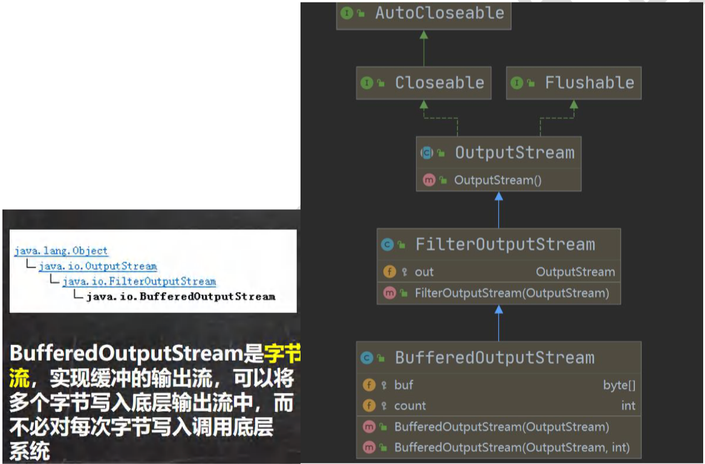
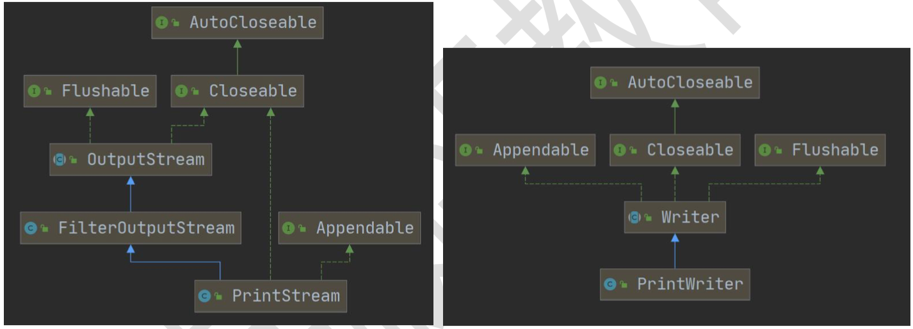
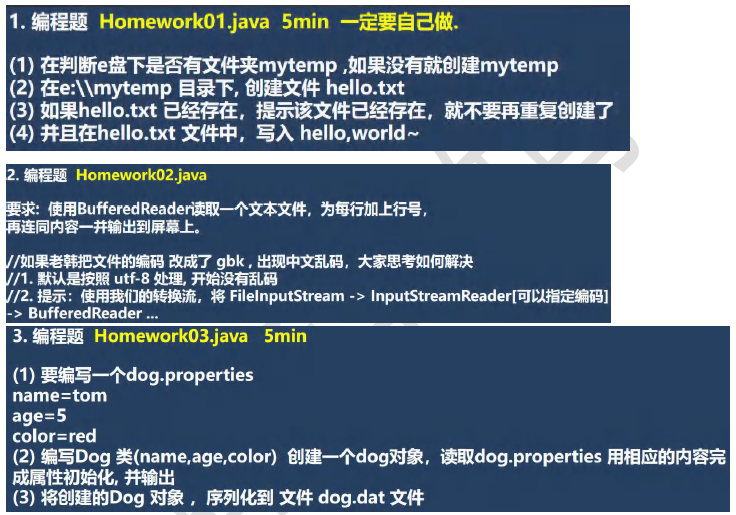

## 第 19 章 io流

### 19.1 文件

#### 19.1.1 什么是文件

​	文件，对我们并不陌生，文件是保存数据的地方，比如我们经常使用的word文档，txt文件,excel文件...都是文件。它既可以保存一张图片，也可以保存视频，声音...

#### 19.1.2 文件流

文件在程序中是以流的形式来操作的

### 19.2 常用的文件操作

#### 19.2.1 创建文件对象相关构造器和方法

- 相关方法

  new File(String pathname) //根据路径创建一个File对象

  new File(File parent,String child) //根据父目录文件+子路径构建

  new File(String parent,String child) //根据父目录+子路径构建

  createNewFile 创建新文件 

  

- 应用案例演示 [FileCreate.java]

  请选择一个目录，创建文件 news1.txt、news2.txt、news3.txt,用 三种不同方式创建

#### 19.2.2 获取文件的相关信息

getName、getAbsolutePath、getParent、length、exists、isFile、isDirectory

#### 19.2.3 应用案例演示 

[FileInformation.java]

如何获取到文件的大小，文件名，路径，父File，是文件还是目录(目录本质也是文件，一种特殊的文件)，是否存在.

#### 19.2.4 目录的操作和文件删除

mkdir创建一级目录、mkdirs创建多级目录、delete删除空目录或文件

#### 19.2.5 应用案例演示

### 19.3 IO 流原理及流的分类

#### 19.3.1 Java IO 流原理

1. I/O是Input/Output的缩写，I/O技术是非常实用的技术，用于处理数据传输。如读/写文件,网络通讯等。
2. Java程序中，对于数据的输入/输出操作以" 流(stream)" 的方式进行。
3. java.io 包下提供了各种 ”流“ 类和接口，用以获取不同种类的数据，并通过方法输入或输出数据
4. 输入input：读取外部数据(磁盘、光盘等存储设备的数据) 到程序 (内存) 中。
5. 输出output：将程序 (内存) 数据输出到磁盘、光盘等存储设备中

19.3.2 流的分类

- 按操作数据单位不同分为：字节流(8 bit)二进制文件，字符流(按字符) 文本文件

- 按数据流的流向不同分为：输入流，输出流

- 按流的角色的不同分为：节点流，处理流/包装流

  | (抽象基类) | 字节流       | 字符流 |
  | ---------- | ------------ | ------ |
  | 输入流     | InputStream  | Reader |
  | 输出流     | OutputStream | Writer |

  1）Java的IO流共涉及40多个类，实际上非常规则，都是从如上4个抽象基类派生的。

  2）右这四个类派生出来的子类名称都是以其父类名作为子类名后缀。

### 19.4 IO 流体系图-常用的类

1. IO 流体系图

   

2. 文件 VS 流

#### 19.4.1 FileInputStream 介绍

#### 19.4.2 FileInputStream 应用实例

[FileInputStream_.java]

要求：请使用 FileInputStream 读取 hello.txt 文件，并将文件内容显示到控制台.

#### 19.4.3 FileOutputStream 介绍

#### 19.4.4 FileOutputStream 应用实例1

[FileOutputStream01.java]

要求：请使用FileOutputStream 在 a.txt 文件，中写入“hello,world”,如果文件不存在，会创建 文件(注意：前提是目录已经存在.)

#### 19.4.5 FileOutputStream  应用实例2

[FileCopy.java]

要求：编程完成图片/音乐 的拷贝.

#### 19.4.6 FileReader 和 FileWriter 介绍

#### 19.4.7 FileReader 相关方法：

1）new FileReader(File/String)

2）read：每次读取单个字符，返回该字符，如果到文件末尾返回-1

3）read(char[])：批量读取多个字符到数组，返回读取到的字符数，如果到文件末尾返回-1

相关API：

1）new String(char[]):将char[]转换成String

2）new String(char[],off,len):将char[]的指定部分转换成String

#### 19.4.8 FileWriter 常用方法

1）new FileWriter(File/String)：覆盖模式，相当于流的指针在首端

2）new FileWriter(File/String,true)：追加模式，相当于流的指针在尾端

3）write(int)：写入单个字符

4）write(char[])：写入指定数组

5）writer(char[],off,len)：写入指定数组的指定部分

6）writer(String)：写入整个字符串

7）write(string,off,len)：写入字符串的指定部分

相关API：String类：toCharArray：将String转换成char[]

- 注意：

  FileWriter使用后，必须要关闭(close)或刷新(flush)，否则写入不到指定的文件！

#### 19.4.9 FileReader 和 FileWriter应用案例

[FileReader_.java]

要求：

1）使用 FileReader 从 story.txt 读取内容，并显示

2）使用 FileWriter 将 "风雨之后，定见彩虹" 写入到 note.txt 文件中，注意细节。

[FileWriter_ .java com.hspedu.writer_]

### 19.5 节点流和处理流

#### 19.5.1 基本介绍

1. 节点流可以从一个特定的数据源读写数据，如FileReader、FileWriter

   

2. 处理流(也叫包装流)是”连接“在已存在的流（节点流或处理流）之上，为程序提供更为强大的读写功能，也更加灵活，如BufferedReader、BufferedWriter

   

#### 19.5.2 节点流和处理流一览图

#### 19.5.3 节点流和处理流的区别和联系

1. 节点流是底层流/低级流，直接跟数据源相接。
2. 处理流(包装流)包装节点流，既可以消除不同节点流的实现差异，也可以提供更方便的方法来完成输入输出。
3. 处理流(也叫包装流)对节点流进行包装，使用了修饰器设计模式，不会直接与数据源相连

#### 19.5.4 处理流的功能主要体现在以下两个方面：

1. 性能的提高：主要以增加缓冲的方式来提高输入输出的效率。
2. 操作的便捷：处理流可以提供了一系列便捷的方法来一次输入输出大批量的数据，使用更加灵活方便

#### 19.5.5 处理流-BufferedReader 和 BufferedWriter

- BufferedReader 和 BufferedWriter 属于字符流，是按照字符来读取数据的

- 关闭时处理流，只需要关闭外层流即可

- 应用案例

  1. 使用BufferedReader 读取文本文件，并显示在控制台[BufferedReader_.java]

  2. 使用BufferedWriter 将”hello，韩顺平教育“，写入到文件中

     [BufferedWriter_.java]

  3. 综合使用BufferedReader 和 BufferedWriter 完成 文本文件拷贝，注意文件编码[BufferedCopy_.java]

#### 19.5.6 处理流-BufferedInputStream 和 BufferedOutputStream

### 19.5.7 介绍 BufferedOutputStream

- 应用案例

  要求：编程完成图片/音乐 的拷贝(要求使用Buffered..流)[BufferedCopy02.java]

#### 19.5.8 对象流-ObjectInputStream 和 ObjectOutputStream

- 看一个需求

  1. 将int num = 100 这个 int 数据保存到文件中，注意不是 100 数字，而是 int，能够从文件中直接恢复 int 100
  2. 将 Dog dog = new Dog("小黄",3) 这个 dog 对象 保存到 文件中，并且能够从文件恢复.
  3. 上面的要求，就是 能够将 基本数据类型 或者 对象 进行序列化 和反序列化操作

- 序列化 和 反序列化

  1. 序列化就是在保存数据时，保存==数据的值==和==数据类型==
  2. 反序列化就是在恢复数据时，恢复==数据的值==和==数据类型==
  3. 需要让某个对象支持序列化机制，则必须让其类是可序列化的，为了让某个类是可序列化的，该类必须实现如下两个接口之一：
     - Serializable	//这是一个标记接口，没有方法
     - Externalizable   //该接口有方法需要实现，因此我们一般实现上面的  Serializable接口

  

#### 19.5.9 对象流介绍

功能：提供了对基本类型或对象类型的序列化和反序列化

ObjectOutputStream 提供 序列化功能

ObjectInputStream 提供 反序列化功能

- 应用案例
  1. 使用ObjectOutputStream 序列化 基本数据类型和 一个 Dog对象(name,age),并保存到 data.dat 文件中 [ObjectOutStream_.java]
  2. 使用ObjectInputStream 读取 data.dat 并反序列化恢复数据

- 注意事项和细节说明

  1）读写顺序要一致

  2）要求序列化或反序列化对象，需要 实现 Serializable

  3）序列化的类中建议添加SerialVersionUID，为了提高版本的兼容性

  4）序列化对象时，默认将里面所有属性都进行序列化，但除了static或者transient修饰的成员

  5）序列化对象时，要求里面属性的类型也需要实现序列化接口

  6）序列化具备可继承，也就是如果某类已经实现了序列化，则它的所有子类也已经默认实现序列化

#### 19.5.10 标准输入输出流

[com.hspedu.standard 	InputAndOutput.java]

- 介绍

  |                     | 类型        | 默认设备 |
  | ------------------- | ----------- | -------- |
  | System.in 标准输入  | InputStream | 键盘     |
  | System.out 标准输出 | PrintStream | 显示器   |

- 应用案例1

  传统方法System.out.println(" ");是使用 out 对象将 数据输出到 显示器

- 应用案例2

  传统的方法,Scanner 是从 标准输入 键盘接收数据

#### 19.5.11 转换流-InputStreamReader 和 OutputStreamWriter

[com.hspedu.transformation	CodeQuestion.java]

转换流 -> 解决文件乱码问题

- 介绍
  1. InputStreamReader:Reader的子类，可以将InputStream(字节流)包装成(转换)Reader(字符流)
  2. OutputStreamWriter:Writer的子类，实现将OutputStream(字节流)包装成Writer(字符流)
  3. 当处理纯文本数据时，如果使用字符流效率更高，并且可以有效解决中文问题，所以建议将字节流转换成字符流
  4. 可以在使用时指定编码格式(比如 utf-8,gbk,gb2312,ISO8859-1 等)
- 应用案例
  1. 编程将 字节流FileInputStream 包装成(转换成) 字符流InputStreamReader,对文件进行读取(按照 utf-8/gbk 格式)，进行在包装成 BufferedReader[InputStreamReader_.java]
  2. 编程将 字节流 FileOutputStream 包装成(转换成) 字符流 OutputStreamWriter，对文件进行写入(按照gbk格式,可以指定其他，比如utf-8)

### 19.6 打印流-PrintStream 和 PrintWriter

[com.hspedu.printstream PrintStream_ .java PrintWriter_ .java]

- 应用实例，打印流只有输出流，没有输入流

### 19.7 Properties 类

#### 19.7.1 看一个需求

[com.hspedu.properties_ Properties01.java]

如下一个配置文件 mysql.properties

ip=192.168.0.13

user=root

pwd=12345

请问编程读取ip、user和pwd 的值是多少

- 分析
  1. 传统的方法
  2. 使用Properties类可以方便实现

#### 19.7.2 基本介绍

1）专门用于读写配置文件的集合类

配置文件的格式：

键=值

键=值

2）注意：键值对不需要有空格，值不需要要用引号引起来。默认类型是String

3）Properties的常见方法

- load：加载配置文件的键值对到Properties对象
- list：将数据显示到指定设备
- getProperty(key)：根据键获取值
- setProperty(key,value)：设置键值对到Properties对象
- store：将Properties中的键值对存储到配置文件，在IDEA中，保存信息到配置文件，如果含有中文，会存储为unicode码

http://tool.chinaz.com/tools/unicode.aspx unicode码查询工具

#### 19.7.3 应用案例

1. 使用Properties类完成对 mysql.properties 的读取
2. 使用Properties类添加key-val 到新文件 mysql2.properties中
3. 使用Properties类完成对mysql2.properties的读取，并修改某个key-val

### 19.8 本章作业

