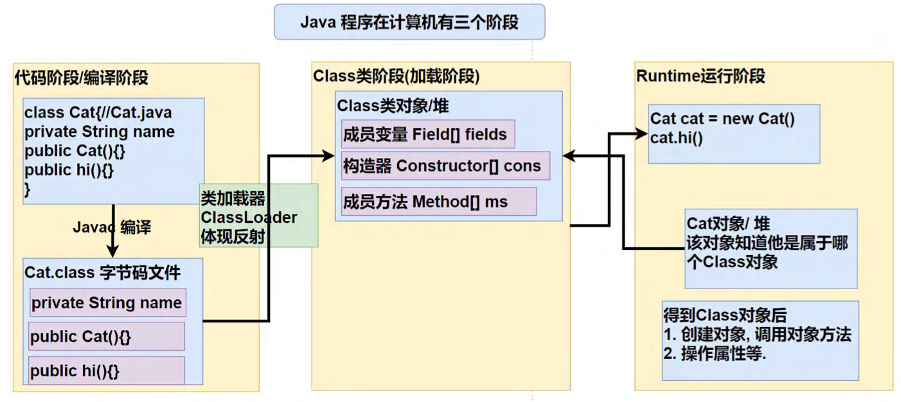

# 第 23 章 反射

## 23.1 一个需求引出反射

### 23.1.1 请看下面的问题

1. 根据配置文件 re.properties 指定信息，创建Cat对象并调用方法hi

   classfullpath=com.hspedu.Cat

   method=hi

2. 这样的需求在学习框架时特别多，即通过外部文件配置，在不修改源码情况下，来控制程序，也符合设计模式的 ocp原则(开闭原则：不修改源码，扩容功能)

3. 快速入门 com.hspedu.reflection.question    ReflectionQusestion.java

## 23.2 反射机制

### 23.2.1 Java Reflection

1. 反射机制允许程序在执行期借助于ReflectionAPI取得任何类的内部信息(比如成员变量，构造器，成员方法等等)，并能操作对象的属性及方法。反射在设计模式和框架底层都会用到
2. 加载完类之后，在堆中就产生了一个Class类型的对象(一个类只有一个Class对象)，这个对象包含了类的完整结构信息。通过这个对象得到类的结构。这个Class对象就像一面镜子，透过这个镜子看到类的结构，所以，形象的称之为：反射

p 对象 --》 类型 Person类

Class对象 cls ---> 类型 Class类

### 23.2.2 Java 反射机制原理示意图！！！

### 23.2.3 Java 反射机制可以完成

1. 在运行时判断任意一个对象所属的类
2. 在运行时创造任意一个类的对象
3. 在运行时得到任意一个类所具有的成员变量和方法
4. 在运行时调用任意一个对象的成员变量和方法
5. 生成动态代理

### 23.2.4 反射相关的主要类

1. Java.lang.Class：代表一个类，Class对象表示某个类加载后在堆中的对象
2. java.lang.reflect.Method：代表类的方法，Method对象表示某个类的方法
3. java.lang.reflect.Field：代表类的成员变量，Field对象表示某个类的成员变量
4. java.lang.reflect.Constructor：代表类的构造方法，Constructor对象表示构造器

这些类在java.lang.reflection

Reflection01.java  com.hspedu.reflecton

### 23.2.5 反射优点和缺点

1. 优点：可以动态的创建和使用对象(也是框架底层核心)，使用灵活，没有反射机制，框架技术就失去底层支撑。
2. 缺点：使用反射基本是解释执行，对执行速度有影响
3. 应用实例：Reflection02.java com.hspedu.reflection

### 23.2.6 反射调用优化-关闭访问检查

1. Method和File、Constructor对象都有setAccessible()方法
2. setAccessible作用是启动和禁用访问安全检查的开关
3. 参数为true表示 反射的对象在使用时取消访问检查，提高放射的效率。参数值为false则表示反射的对象执行访问检查

## 23.3 Class类

### 23.3.1 基本介绍

[Class01.java] [com.hspedu.reflection.class_]

1. 